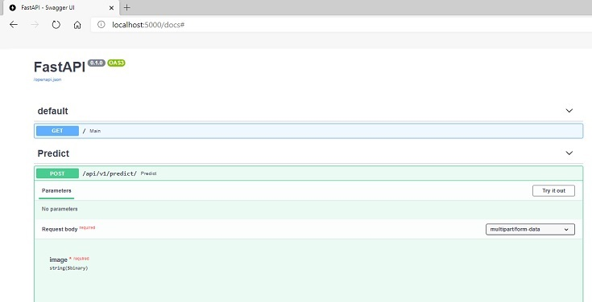

# Machine Learning with Keras and FastAPI

## Getting started

Build a web application for image classification using FastAPI and Keras pre-trained model

***Prerequisites***

```code
$ pip install -r requirements.txt
```

***Running the web app***

```code
$ uvicorn main:app --reload
```

## Image classification

Upload an image using `interactive API documentaions`



***Definition***

```json
POST /api/v1/predict
```

***Response***

- `202 ACCEPTED` on success

All responses will have the form

```json
{
    "message" : "success",
    "predictions" : {
        "..." : "..%",
        "..." : "..%",
        "..." : "..%"
    }
}
```

**General rule for running `main.py`**

- Run `uvicorn main:app --reload` from the command line for local development.
- Run `gunicorn -k uvicorn.workers.UvicornWorker main:app` for production and server development.

